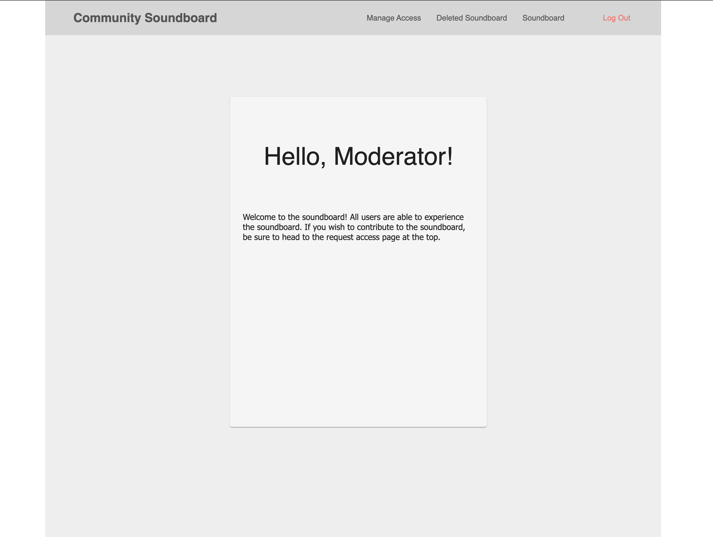

# Community Soundboard Template

## Table of Contents

- [Description](#description)
- [Screenshots](#screenshots)
- [Built With](#built-with)
- [Getting Started](#getting-started)
  - [Prerequisites](#prerequisites)
  - [Installation](#installation)
- [Usage](#usage)
- [License](#license)
- [Acknowledgements](#acknowledgements)
- [Contacts](#contacts)

## Description

A starter template on the PERN stack for hosting a soundboard for a community. The template utilizes Cloudinary's API for .mp3 hosting. The template has 4 user access levels. Admin, Moderator, Member, and New User. The template has data persistence by using a "deleted" boolean for handling deletes.

## Built With

## Getting Started

Visit the deployed version of the app on Heroku here:https://community-soundboard.herokuapp.com/ and register an account.

Moderator login:  
Username - Moderator  
Password - 1234  

With the moderator login you can experience the ManageAccess view, and give your account access to the soundboard. Once accounts have access they are able to contribute their own clips to the soundboard by having access to the Add a Clip button.

## Screenshots

### Prerequisites

This version uses React, Redux, Express, Passport, and PostgreSQL (a full list of dependencies can be found in`package.json`).

Before you get started, make sure you have the following software installed on your computer:

- [Node.js](https://nodejs.org/en/)
- [PostrgeSQL](https://www.postgresql.org/)
- [Nodemon](https://nodemon.io/)

Create a new database called `community_soundboard` and create the tables needed by running SQL statements from the database.sql file.

If you would like to name your database something else, you will need to change `community_soundboard` to the name of your new database in `server/modules/pool.js`.

Directory Structure:

- `src/` contains the React application
- `public/` contains static assets for the client-side
- `build/` after you build the project, contains the transpiled code from `src/` and `public/` that will be viewed on the production site
- `server/` contains the Express App

### Installation

Clone the repository and npm install in the terminal. Then in 2 separate terminals, npm run server in one and npm run client in the other. To upload soundclips you will need to create an account with Cloudinary and put your API keys in your .env file.

## Usage

If you're a new user, register an account to log in. If you're already registered, log in to your existing account.

## Contacts

  
